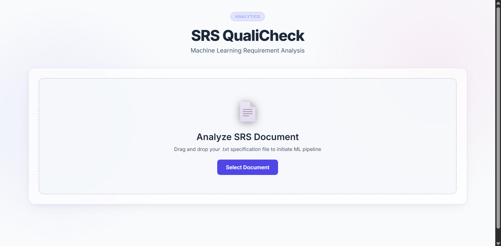
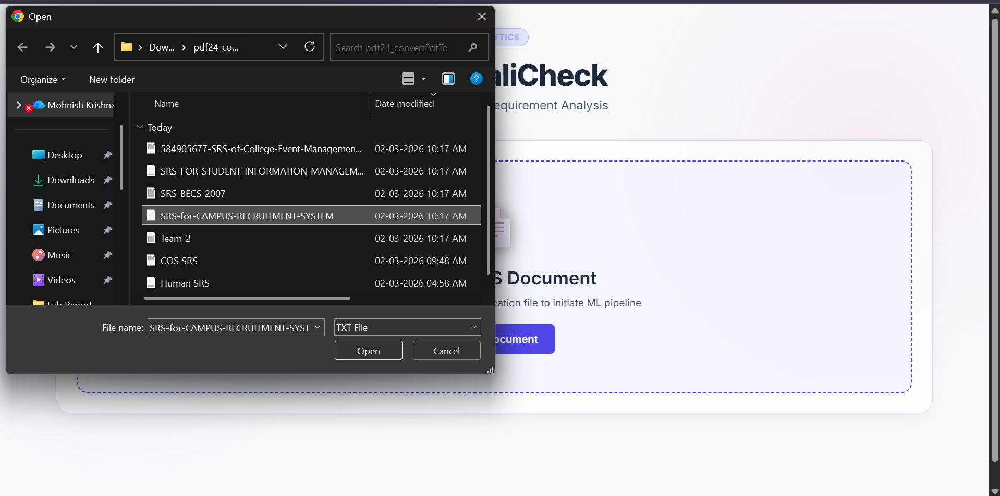
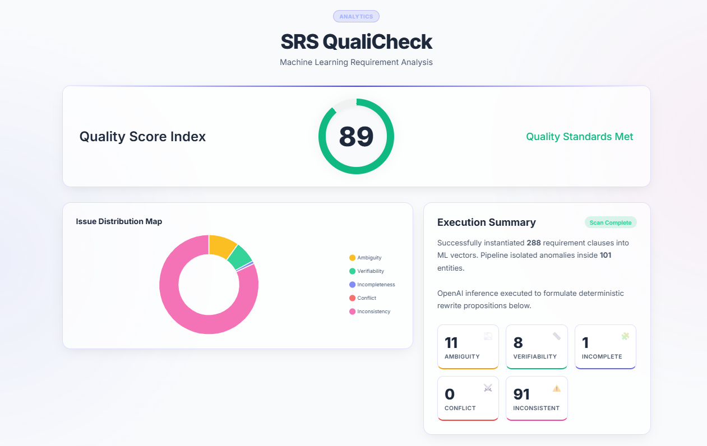
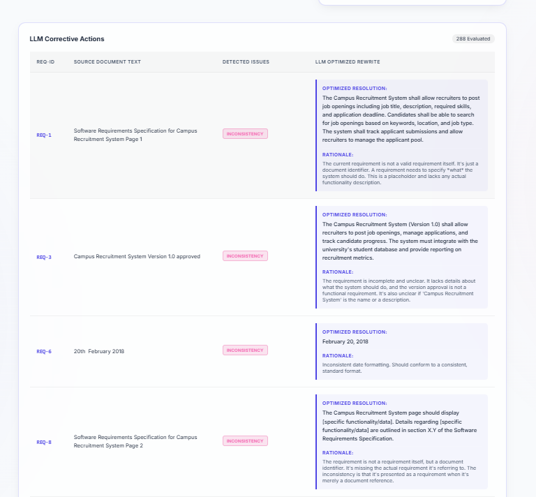

# 🚀 SRS QualiCheck - Requirements Analysis System

Machine Learning & LLM-Powered web application that analyzes Software Requirements Specification (SRS) documents to predict quality issues and generate explainable AI corrective actions.

---

## 🏗 Architecture Overview

SRS QualiCheck follows a modular machine learning and AI decision pipeline:

```text
SRS Document Upload (.txt)
   ↓
Requirement Parsing & Extraction
   ↓
TF-IDF Vectorization
   ↓
SVM Classification Engine (Detects Ambiguity, Incompleteness, etc.)
   ↓
Heuristic Rules Check (Conflict & Inconsistency)
   ↓
Recommendation Engine (OpenRouter AI)
   ↓
Structured UI Dashboard & Quality Score
```

### Key Layers

* **Data ingestion** — TXT parsing
* **Inference layer** — TF-IDF + Support Vector Machine
* **Rule layer** — Text matching for conflicts & inconsistencies
* **Explainability & Correction layer** — Deterministic LLM reasoning (Gemma 3)
* **Presentation layer** — Glassmorphism Dashboard + Chart.js

---

## 🛠 Tech Stack

### Backend

* Python
* Flask

### AI / Machine Learning

* OpenRouter API (`google/gemma-3n-e4b-it:free`)
* Scikit-Learn (LinearSVC, TfidfVectorizer)

### Frontend

* HTML
* CSS (Day Mode / Glassmorphism)
* Vanilla JavaScript
* Chart.js

### Data

* TXT (Requirements Specification format)

---

## 📦 Installation Instructions

### 1. Clone repository

```bash
git clone <https://github.com/mohnishkrishna-saikumar-mk9/SRS-QualiCheck/tree/main>
cd srs-qualicheck
```

### 2. Install dependencies

```bash
pip install -r requirements.txt
```

### 3. Create environment file

Create `.env` and add your OpenRouter API key:

```env
OPENROUTER_API_KEY=your_openrouter_key_here
```

### 4. Run locally

```bash
python app.py
```

Open:

```text
http://localhost:5000
```

---

## 🔌 API Documentation

### POST `/analyze`

Analyzes uploaded SRS document.

**Request**

* Multipart form
  * `file`: The `.txt` document containing requirements.

**Response**
Returns structured JSON:

```json
{
  "stats": {
    "total": 299,
    "ambiguity": 2,
    "verifiability": 2,
    "incompleteness": 3,
    "conflict": 2,
    "inconsistency": 7,
    "score": 64
  },
  "requirements": [
    {
      "id": "REQ-1",
      "text": "Requirement string...",
      "issues": ["ambiguity"],
      "suggestion": {
        "explanation": "Reasoning...",
        "improved": "Better requirement string..."
      }
    }
  ]
}
```

---

## ▶️ Usage Examples

### Example Workflow

1. Upload SRS `.txt` file
2. Wait for the dynamically loading progress bar
3. View the **Quality Score Index** and **Issue Distribution Map**
4. Scroll to view:
   * Detected Issues (Tags)
   * Original Requirement Text
   * AI Optimized Resolution
   * AI Rationale / Reasoning

---

### Example Technical Scenario

**Input**

* "The system is expected to evolve over several releases, ultimately connecting to the Internet ordering services."

**Output**

* **Detected Issues**: Ambiguity, Verifiability
* **Optimized Resolution**: The system shall implement API connections to at least 3 local restaurant internet ordering services and 1 credit card authorization service by Release 3.0.
* **Rationale**: Replaced vague terms like "several releases" and "several local restaurants" with specific, verifiable metrics.

---

# 📸 Interface Preview

## [Home Screen]


## [upload section]


## [Result page]


## [LLM JSON Suggestion]



## 🧠 Explainable AI Approach

* Detection is classification-based (SVM) combined with heuristic rules.
* Correction and explanation uses an LLM with structured context.
* Ensures transparency and reproducibility in requirement optimization.

---

## 👥 Team Members

- **G Mohnish Krishna Saikumar** — [GitHub](https://github.com/mohnishkrishna-saikumar-mk9)
- **Vikram Shanbhag** – [GitHub](https://github.com/VikramS28)
- **A Surendra Naidu** - [GitHub](https://github.com/arigisurendranaidu2005-code)


